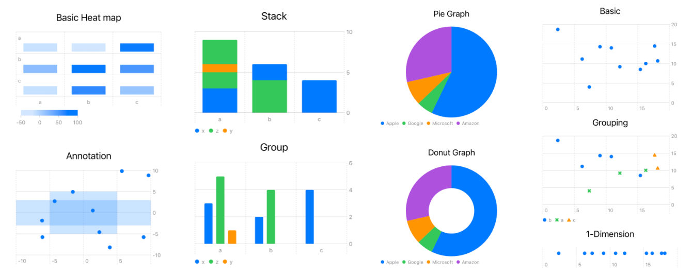
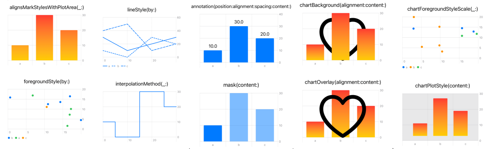
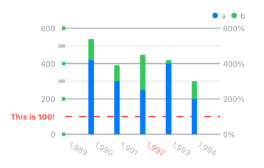
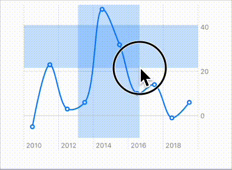
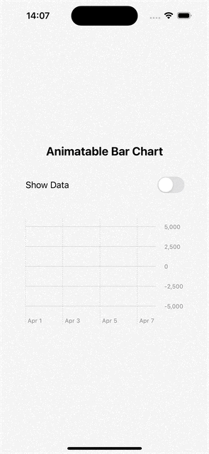

# Swift Charts Demo

A demo on how to use Swift Charts to create informative graphic visualizations.

### Marks

1. [AreaMark](https://developer.apple.com/documentation/charts/areamark)
2. [BarMark](https://developer.apple.com/documentation/charts/barmark)
3. [LineMark](https://developer.apple.com/documentation/charts/linemark)
4. [PointMark](https://developer.apple.com/documentation/charts/pointmark)
5. [RectangleMark](https://developer.apple.com/documentation/charts/rectanglemark)
6. [RuleMark](https://developer.apple.com/documentation/charts/rulemark)
7. [SectorMark](https://developer.apple.com/documentation/charts/sectormark)

### Styling Marks and Charts

### Customize Axes and Legends

### Interactive Charts
1. `chartXSelection(value:)` and `chartYSelection(value:)` for single value selection
2. `chartAngleSelection(value:)` for `SectorMark` selection
3. `chartXSelection(range:)` and `chartYSelection(range:)` for range selection
4. `chartGesture(_:)` for custom gesture. Examples included: 
    - Drag Gesture for Range Selection
    - Select Only If Data Point Exists

### Charts Animation

#### LineMark

#### BarMark

## Related Blogs
For more details, please check out my blogs.
1. [Swift Charts: Show Off Our Data with Marks](https://medium.com/@itsuki.enjoy/swift-charts-show-off-our-data-with-marks-bc3125539856)
2. [Swift Charts: Styling Marks and Charts](https://medium.com/@itsuki.enjoy/swift-charts-master-marks-and-charts-styling-13ac23302c16)
3. [Swift Charts: Axis & Legend Customization](https://medium.com/gitconnected/swift-charts-axis-legend-customization-27077b56714b)
4. [SwiftUI: Interactive Charts](https://medium.com/@itsuki.enjoy/swiftui-interactive-charts-c222f9d7133f)
5. [Swift Charts: Animate Marks]()
